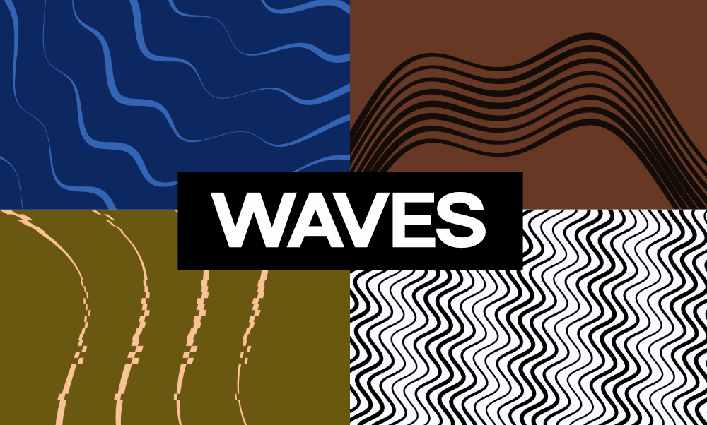

# Waves



[Open Waves Editor](https://waves.ruverse.ai/)

A deterministic animated-wave renderer and visual editor. The reusable renderer is published as `@ruverse/waves`; the Svelte app is the source for portable configurations, images, and embeds.

## Package

Install the package:

```sh
npm install @ruverse/waves
```

Copy a compact string from the editor's Share menu and mount it directly into
any sized element:

```js
import { mountWave } from '@ruverse/waves';

const compact = 'waves:v1:{"s":42,"a":52,"n":7,"bg":"transparent"}';
const handle = mountWave(document.querySelector('#waves'), compact);

// Compact strings are complete snapshots, so omitted values return to defaults.
handle.update('waves:v1:{"s":84}');

// Object updates remain partial merges with the mounted configuration.
handle.update({ waveCount: 5 });

handle.destroy();
```

Create, encode, and decode compact strings programmatically:

```js
import {
  createWaveConfig,
  decodeWaveConfig,
  encodeWaveConfig,
  mountWave
} from '@ruverse/waves';

const config = createWaveConfig({
  seed: 42,
  waveCount: 7,
  amplitude: 52,
  backgroundColor: 'transparent',
  waveColor: 'rgba(255, 255, 255, 0.14)',
  variations: {
    amplitude: 0.2,
    rotation: 0.04,
    spacing: 0.08
  }
});

const compact = encodeWaveConfig(config);
const normalized = decodeWaveConfig(compact);
mountWave(document.querySelector('#waves'), compact);
```

The default configuration encodes as `waves:v1:{}`. The codec validates aliases
and payload types without evaluating code, and can be used during server
rendering. The container controls the rendered size and must have non-zero width
and height. The runtime has no dependencies, pauses while offscreen, respects
reduced-motion preferences, and accesses browser globals only after
`mountWave()` is called.

Build and test the publishable package:

```sh
bun run build:lib
bun run test:package
npm pack --dry-run
```

Repository builds prepare and attest release artifacts but do not publish them
automatically.


## Visual editor

The editor lets you customize amplitude, wavelength, frequency, period,
rotation, curvature, glitch, spacing, thickness, taper, colors, variation, and
wave count. Configurations can be saved locally or shared as a portable compact
string, image, or self-contained web embed.

## Run Locally

Prerequisites:

- Bun 1.3 or newer

Install dependencies:

```sh
bun install --frozen-lockfile
```

Start the development server:

```sh
bun run dev
```

Vite will print a local URL, usually `http://localhost:5173/`, where you can open the app in your browser.

To create a production build:

```sh
bun run build
```

To preview the production build locally:

```sh
bun run preview
```

## Releases

Package releases are prepared on `dev` and moved to the release-only `main`
branch through a release pull request. After the pull request is merged, an
exact numeric tag matching `package.json` triggers the GitHub Actions release
workflow.

The workflow runs the editor and package checks, creates and smoke-tests the npm
tarball, attests its provenance, and attaches it to a draft GitHub Release for
maintainer review. It does not publish to npm automatically. See
[`AGENTS.md`](./AGENTS.md) for the complete release procedure.
